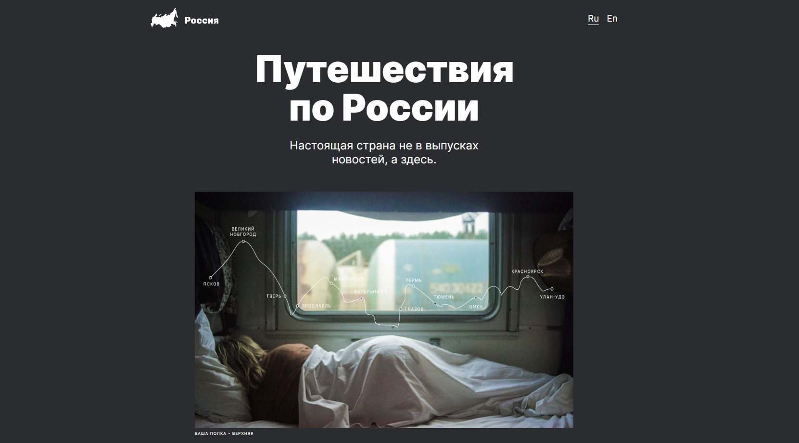
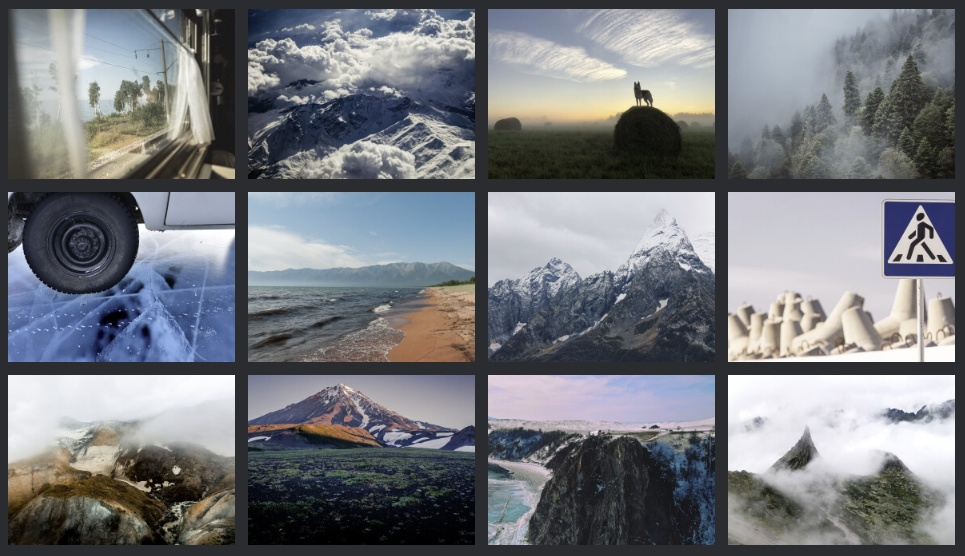
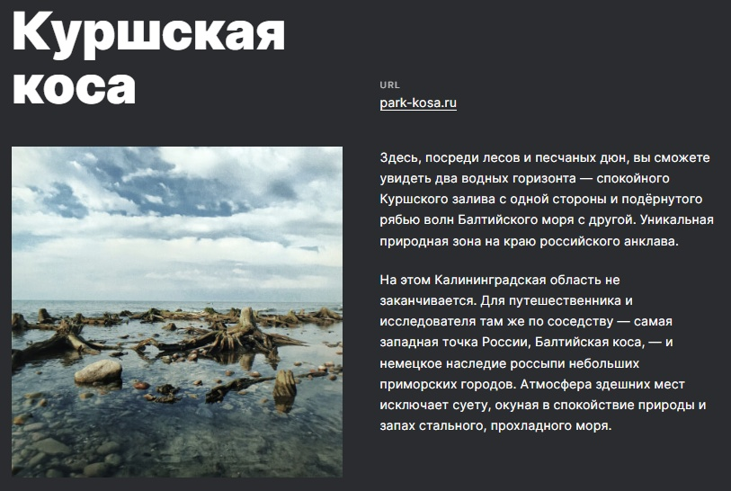
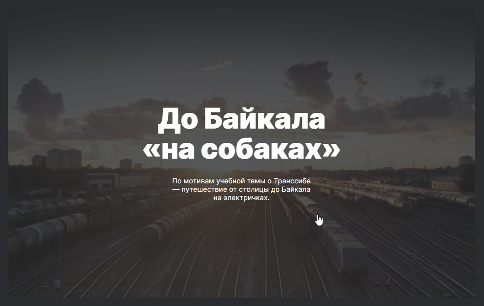

# Проект: Путешествие по России

## Обзор

**[Перейти на сайт](https://shekko777.github.io/russian-travel/)**



---

## О проекте

**Туристический сайт по красивой России.**

1. Резиновая легко дополняющаяся галлерея

   

2. Описание и ссылки на красивые места

   

3. Быстрые и удобные ссылки на полезные ресурсы

   

---

## Установка

```
git clone https://github.com/Shekko777/russian-travel.git
```

---

## Технологии

1. **Grid layout**
   _для построения резиновой фото галлереии и сетки мест_

```
    display: grid;
    grid-template-columns: repeat(4, minmax(200px, 1fr));
```

2. **@media запросы**
   _для создания адаптивности под любые устройства_

```
    @media screen and (max-width: 1024px) {};
```

3. **bem nested**
   _Для разбиения проекта на удобную файловую структуру для
   быстрого доступа и редактирования_

---

### Доработки и планы

1. Планируется создать секцию с музыкой
2. Написать **API** видео-плеер после JS
